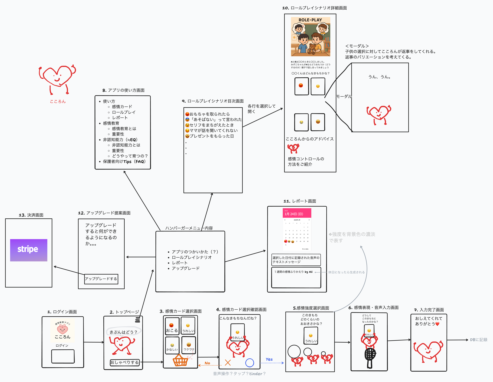

# 画面設計

## 画面一覧・概要図

## 画面一覧・仕様

各画面における構成要素、目的、機能、画面遷移の概要を以下に記載する。

1.  ログイン画面
    **目的**
    保護者がアカウントで安全にログインし、個別データを利用できるようにする。

    **構成要素**
    - キャラクター(こころん)表示（親しみや安心感）
    - ログインフォーム

2.  トップページ（ホーム画面）
    **目的**
    子どもが自然にアプリを開始できるよう、キャラクターとの親しみやすい導入を提供する。

    **構成要素**
    - キャラクター(こころん)による問いかけ（例：「きょうの きぶんは　どう？」）
    - おしゃべりボタン（感情カード選択画面へ遷移）
    - ハンバーガーメニュー
      - アプリのつかいかた（アプリの使い方画面へ遷移）
      - ロールプレイシナリオ（ロールプレイシナリオ目次画面へ遷移）
      - レポート（レポート画面へ遷移）
      - アップグレード（アップグレード提案画面へ遷移）

3.  感情カード選択画面
    **目的**
    子どもが自分の感情を視覚的に選択しできるようにする。

    **構成要素**
    - 複数の感情カード（イラスト＋名称）
    - かご（感情カードをドラッグしてカゴに入れると選択確認画面へ遷移）

4.  感情カード選択確認画面
    **目的**
    感情カード選択時の誤操作防止のために選択した感情カードの確認をする。

    **構成要素**
    - キャラクター(こころん)による問いかけ（例：「こんな　きもち　なんだね？」）
    - ❌ボタン（感情カード選択画面へ遷移）
    - ⭕️ボタン（感情強度選択画面へ遷移）

5.  感情強度選択画面
    **目的**
    選んだ感情の強さを子どもが表現できるように促す。

    **構成要素**
    - キャラクター(こころん)表示
    - キャラクター(こころん)による問いかけ（例：「この　きもち　どのくらいの　おおきさかな？」）
    - 前画面の感情を確認できるUI
    - 3?5?段階の強度選択ボタン（感情表現・音声入力画面へ遷移）

6.  感情表現・音声入力画面
    **目的**
    感情の背景にある体験や出来事を子ども自身の言葉で表現する練習を促す。

    **構成要素**
    - キャラクター(こころん)表示
    - キャラクター(こころん)による問いかけ（例：「どうして　このきもちに　なったのかな？」）
    - マイク

    <要相談>
    - 音声入力のスタートはこころんからの問いかけが終わった時点？（え？もう話していいの？とか戸惑いそう）
    - マイクをボタンにして録音開始と終了操作をしてもらう？
    - 録音スタートボタンと録音終了ボタンを用意する？（未就学児がわかるデザインが必要）

7.  入力完了画面
    **目的**
    ユーザー体験をやさしく締めくくり、感情表現の成功体験として記憶づける。

    **構成要素**
    - こころんのイラスト
    - キャラクター(こころん)によるコメント（例：「おしえてくれて　ありがとう💗」）

8.  アプリの使い方画面
    **目的**
    保護者に向けてアプリの目的・使い方・教育的意義をわかりやすく提示する。

    **構成要素**
    - 各機能の紹介
      - 感情カード
      - ロールプレイ
      - レポート）
    - 感情教育
      - 感情教育とは
      - 重要性とは
    - 非認知能力（EQ）
      - 非認知能力とは
      - 重要性
      - どうやって育つの？
    - 保護者向けTips（FAQ）
      など

9.  ロールプレイシナリオ目次画面
    **目的**
    子どもが日常的なシチュエーションの中で共感力や想像力を育むことができるように導くシナリオを一覧表示する。

    **構成要素**
    - シナリオタイトルリスト（例）：
      - おもちゃを取られたら
      - 「あそばない」って言われた
      - セリフをまちがえたとき
      - ママが話を聞いてくれない
      - プレゼントをもらった日
    - 各シナリオで想定される感情を表すアイコン
      （各シナリオをタップで詳細へ遷移）

10. ロールプレイシナリオ詳細画面
    **目的**
    シナリオごとに、感情のやりとりを模擬体験することで実践力を育てる。

    **構成要素**
    - シナリオを象徴する挿絵
    - キャラクター(こころん)による問いかけ１（例：「ゆう君は保育園で遊んでいる時たかし君におもちゃを取られてしまいました。みずこちゃんがゆう君ならどう思うかな？」）
    - 感情カード（みずこちゃんが選択すると、こころんが　新たな問いかけをする）
    - キャラクター(こころん)による問いかけ２（例：「そうだね。ゆう君は怒ったんだね。じゃあ2人で仲良く遊ぶために、たかし君はどうしたらよかったかな？パパやママと話し合ってみようか！」）
    - こころんからのアドバイス（例）：
      - おこったときは３回、大きく息を吸って吐いてみよう！
      - おもちゃを取られて嫌だったことを伝えてみよう!

11. レポート画面
    **目的**
    子ども・保護者が感情の履歴を視覚的に把握し、傾向を認識できるようにする。

    **構成要素**
    - カレンダー形式（日付を選択するとその日に記録された音声のテキストが表示される。）
    - 感情タイプごとの色分け
    - 強度は濃淡などで表現
    - 選択された日付に記録された音声のテキスト
    - １週間の感情の振り返り by AI(休日になったら生成される)

12. アップグレード提案画面
    **目的**
    有料プランのベネフィットを明示し、ユーザーを自然にアップグレードへ誘導する。

    **構成要素**
    - アップグレードによって可能になる機能一覧
    - 「アップグレードする」ボタン（選択すると決済画面へ遷移）

13. 決済画面（Stripe連携）
    **目的**
    安全かつ簡便に課金処理を行う。

    **構成要素**
    - Stripeの外部決済フォームへのリダイレクト

## 備考：

### 画面遷移はシンプルかつ子ども目線で操作できる構成にする。

## 3~5歳の特徴

- 文字の読み書きが未習得
- スワイプ好き
- 見た目重視, カラフルなもの
- 聴く専
- 簡単な言葉じゃないと理解できない, ちいちゃい子がわかる簡単な表現にする
- 漢字あまり使わない, るびふる
- キャラクター反応度高い！
- ボタン好き
- 🔑が好き
- 集中力が短い
- シールとかスタンプ大好き
- 大人の真似っこ大好き
- スマホはまっちゃう

### タップ領域は十分に確保（目安：44px以上）

### 文字サイズ・色コントラストはWCAG基準を意識

**WCAG 公式ガイドライン**

- 公式： https://www.w3.org/WAI/WCAG21/quickref/
- 総務省の日本語Ver.： https://waic.jp/docs/WCAG21/

## 文字サイズ

WCAG自体は具体的な推奨フォントサイズを強制してないがスマホの画面では**14〜18px**以上にすることが多い

## 色コントラスト

**WebAIM Contrast Checker**: WCAGの合否判定をリアルタイムでチェックできるツール。

- https://webaim.org/resources/contrastchecker/

**Colorable**: コントラスト比を保ちながら配色パターンを探せるツール

- https://colorable.jxnblk.com/
- 子ども向けアプリなら「コントラストは**5:1以上**」を目標にすると安心

**Color Oracle**: 色覚異常の見え方を画面全体で再現できるツール

- https://colororacle.org/
