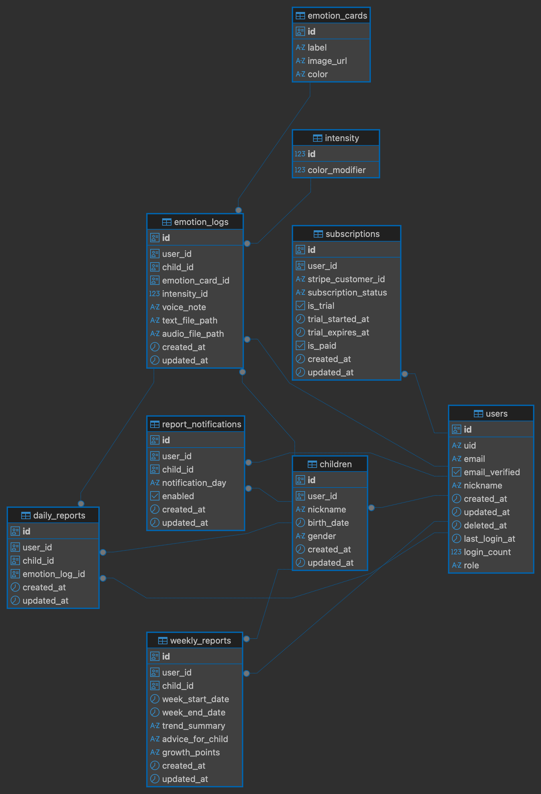

# データベース設計

## 目的

本ドキュメントは、感情教育アプリ『きもちみっけ！』のデータベース設計を明確に定義し、開発チームがデータモデルを理解し、適切なクエリ設計とデータ管理を実現することを目的としています。

## このドキュメントの使い方

データベースのテーブル構成や ER 図を確認したい時に参照してください。データモデルの理解やクエリ設計に使用します。



本システムでは以下のテーブルを用いて、保護者および子どもの感情記録を管理しています。

## テーブル概要

- `users`：Firebase 認証でログインする保護者データを格納
- `children`：兄弟それぞれのプロフィールを格納
- `emotion_logs`：子どもの感情記録（音声/テキストファイルパス含む）を格納
- `emotion_cards`：感情カードのマスターデータ
- `intensity`：感情の強度（色変化等に使用）
- `daily_reports`：日ごとの LLM 生成レポート
- `weekly_reports`：週ごとの LLM 生成レポート
- `report_notifications`：週次レポートの通知設定
- `subscriptions`：課金・トライアル情報

## 各テーブルの定義とインデックス・制約

## 以下は、本アプリにおける主要なデータベーステーブルの構造、インデックス、制約の定義です。

## `users`（保護者）

### テーブル定義

| カラム名       | データ型 | NULL                       | 説明                       |
| -------------- | -------- | -------------------------- | -------------------------- |
| id             | UUID     | NOT NULL                   | 主キー                     |
| uid            | String   | NOT NULL                   | Firebase UID（ユニーク）   |
| email          | String   | NOT NULL                   | メールアドレス（ユニーク） |
| email_verified | Boolean  | NOT NULL                   | メールアドレスの検証状態   |
| nickname       | String   | NULL                       | 表示名                     |
| last_login_at  | DateTime | NULL                       | 最終ログイン日時           |
| login_count    | Integer  | NOT NULL（default=0）      | ログイン回数               |
| role           | String   | NOT NULL（default='user'） | 権限                       |
| created_at     | DateTime | NOT NULL                   | 登録日時                   |
| updated_at     | DateTime | NOT NULL                   | 更新日時                   |
| deleted_at     | DateTime | NULL                       | 退会日時                   |

### インデックス・制約

- `uid`, `email`: 一意制約・インデックスあり
- `id`: プライマリキー

### リレーションシップ

- `subscriptions`: 1 対 1（ユーザーごとに 1 つのサブスクリプション）
- `children`: 1 対多（ユーザーは複数の子どもを持つ）
- `emotion_logs`: 1 対多（ユーザーは複数の感情記録を持つ）
- `daily_reports`: 1 対多（ユーザーは複数の日次レポートを持つ）
- `weekly_reports`: 1 対多（ユーザーは複数の週次レポートを持つ）
- `report_notifications`: 1 対多（ユーザーは複数の通知設定を持つ）

---

## `subscriptions`（課金情報）

### テーブル定義

| カラム名               | データ型 | NULL                      | 説明                         |
| ---------------------- | -------- | ------------------------- | ---------------------------- |
| id                     | UUID     | NOT NULL                  | 主キー                       |
| user_id                | UUID     | NOT NULL                  | ユーザー ID（ユニーク）      |
| stripe_customer_id     | String   | NULL                      | Stripe 顧客 ID（ユニーク）   |
| stripe_subscription_id | String   | NULL                      | Stripe サブスクリプション ID |
| subscription_status    | String   | NULL                      | Stripe サブスク状態          |
| is_trial               | Boolean  | NOT NULL（default=True）  | トライアル中かどうか         |
| is_paid                | Boolean  | NOT NULL（default=False） | 有料会員かどうか             |
| trial_started_at       | DateTime | NULL                      | トライアル開始日時           |
| trial_expires_at       | DateTime | NULL                      | トライアル終了日時           |
| created_at             | DateTime | NOT NULL                  | 登録日時                     |
| updated_at             | DateTime | NOT NULL                  | 更新日時                     |

### インデックス・制約

- `user_id`: 一意制約・インデックスあり（ユーザーごとに 1 件）
- `stripe_customer_id`: 一意制約あり

### リレーションシップ

- `user`: 多対 1（サブスクリプションは 1 つのユーザーに属する）

---

## `children`（子どもプロフィール）

### テーブル定義

| カラム名   | データ型 | NULL     | 説明              |
| ---------- | -------- | -------- | ----------------- |
| id         | UUID     | NOT NULL | 主キー            |
| user_id    | UUID     | NOT NULL | 保護者ユーザー ID |
| nickname   | String   | NOT NULL | 子どもの表示名    |
| birth_date | Date     | NOT NULL | 生年月日          |
| gender     | String   | NOT NULL | 性別              |
| created_at | DateTime | NOT NULL | 登録日時          |
| updated_at | DateTime | NOT NULL | 更新日時          |

### インデックス・制約

- `user_id`: インデックスあり

### リレーションシップ

- `user`: 多対 1（子どもは 1 つのユーザーに属する）
- `emotion_logs`: 1 対多（子どもは複数の感情記録を持つ）
- `daily_reports`: 1 対多（子どもは複数の日次レポートを持つ）
- `weekly_reports`: 1 対多（子どもは複数の週次レポートを持つ）
- `report_notifications`: 1 対多（子どもは複数の通知設定を持つ）

---

## `emotion_cards`（感情カードマスタ）

### テーブル定義

| カラム名  | データ型 | NULL     | 説明     |
| --------- | -------- | -------- | -------- |
| id        | UUID     | NOT NULL | 主キー   |
| label     | String   | NOT NULL | 感情名   |
| image_url | String   | NOT NULL | 画像パス |
| color     | String   | NOT NULL | 色情報   |

---

## `intensity`（感情の強度）

### テーブル定義

| カラム名       | データ型   | NULL     | 説明           |
| -------------- | ---------- | -------- | -------------- |
| id             | BigInteger | NOT NULL | 主キー         |
| color_modifier | Integer    | NOT NULL | 色の明度変更値 |

---

## `emotion_logs`（感情記録）

### テーブル定義

| カラム名        | データ型 | NULL     | 説明                     |
| --------------- | -------- | -------- | ------------------------ |
| id              | UUID     | NOT NULL | 主キー                   |
| user_id         | UUID     | NOT NULL | 保護者 ID                |
| child_id        | UUID     | NOT NULL | 子ども ID                |
| emotion_card_id | UUID     | NOT NULL | 感情カード ID            |
| intensity_id    | Integer  | NOT NULL | 感情の強度 ID            |
| voice_note      | Text     | NULL     | 音声入力のテキスト内容   |
| text_file_path  | String   | NULL     | テキストファイル S3 パス |
| audio_file_path | String   | NOT NULL | 音声ファイル S3 パス     |
| created_at      | DateTime | NOT NULL | 記録日時                 |
| updated_at      | DateTime | NOT NULL | 更新日時                 |

### インデックス・制約

- `child_id`: インデックスあり

### リレーションシップ

- `user`: 多対 1（感情記録は 1 つのユーザーに属する）
- `child`: 多対 1（感情記録は 1 つの子どもに属する）
- `emotion_card`: 多対 1（感情記録は 1 つの感情カードに属する）
- `intensity`: 多対 1（感情記録は 1 つの強度に属する）
- `daily_report`: 1 対 1（感情記録は 1 つの日次レポートに属する）

---

## `daily_reports`（日次レポート）

### テーブル定義

| カラム名       | データ型 | NULL     | 説明                    |
| -------------- | -------- | -------- | ----------------------- |
| id             | UUID     | NOT NULL | 主キー                  |
| user_id        | UUID     | NOT NULL | 保護者 ID               |
| child_id       | UUID     | NOT NULL | 子ども ID               |
| emotion_log_id | UUID     | NOT NULL | 感情記録 ID（ユニーク） |
| created_at     | DateTime | NOT NULL | 登録日時                |
| updated_at     | DateTime | NOT NULL | 更新日時                |

### インデックス・制約

- `child_id`: インデックスあり
- `emotion_log_id`: 一意制約あり

### リレーションシップ

- `user`: 多対 1（日次レポートは 1 つのユーザーに属する）
- `child`: 多対 1（日次レポートは 1 つの子どもに属する）
- `emotion_log`: 1 対 1（日次レポートは 1 つの感情記録に属する）

---

## `weekly_reports`（週次レポート）

### テーブル定義

| カラム名         | データ型 | NULL     | 説明                     |
| ---------------- | -------- | -------- | ------------------------ |
| id               | UUID     | NOT NULL | 主キー                   |
| user_id          | UUID     | NOT NULL | 保護者 ID                |
| child_id         | UUID     | NOT NULL | 子ども ID                |
| week_start_date  | Date     | NOT NULL | 対象週開始日             |
| week_end_date    | Date     | NOT NULL | 対象週終了日             |
| trend_summary    | Text     | NOT NULL | 感情の傾向（LLM 生成）   |
| advice_for_child | Text     | NOT NULL | 声かけ例（LLM 生成）     |
| growth_points    | Text     | NOT NULL | 成長ポイント（LLM 生成） |
| created_at       | DateTime | NOT NULL | 登録日時                 |
| updated_at       | DateTime | NOT NULL | 更新日時                 |

### インデックス・制約

- `child_id`: インデックスあり

### リレーションシップ

- `user`: 多対 1（週次レポートは 1 つのユーザーに属する）
- `child`: 多対 1（週次レポートは 1 つの子どもに属する）

---

## `report_notifications`（レポート通知設定）

### テーブル定義

| カラム名         | データ型 | NULL     | 説明                       |
| ---------------- | -------- | -------- | -------------------------- |
| id               | UUID     | NOT NULL | 主キー                     |
| user_id          | UUID     | NOT NULL | 保護者 ID                  |
| child_id         | UUID     | NOT NULL | 子ども ID                  |
| notification_day | String   | NULL     | 曜日文字列（例：'sunday'） |
| enabled          | Boolean  | NOT NULL | 通知有効フラグ             |
| created_at       | DateTime | NOT NULL | 登録日時                   |
| updated_at       | DateTime | NOT NULL | 更新日時                   |

### インデックス・制約

- `child_id`: インデックスあり

### リレーションシップ

- `user`: 多対 1（通知設定は 1 つのユーザーに属する）
- `child`: 多対 1（通知設定は 1 つの子どもに属する）

---

## 音声処理フロー

### 概要

本システムでは、子どもの音声を録音し、AI による音声認識を経て感情記録として保存する処理フローを実装しています。

### 処理フロー詳細

#### 1. 音声録音

- **フロントエンド**: MediaRecorder API を使用して WebM 形式で録音
- **録音設定**: 16kHz/モノラル/16bit
- **ファイル形式**: WebM（VP8/VP9）、WAV、MP3、M4A 対応

#### 2. S3 アップロード

- **方式**: Presigned URL を使用した直接アップロード
- **セキュリティ**: 一時的な権限（1 時間有効）による安全なアップロード
- **パス構造**: `voice-uploads/{file_type}/{user_id}/{YYYY/MM/DD}/{unique_id}_{file_name}`

#### 3. 音声正規化

- **ツール**: `normalize_to_wav16k_mono` 関数を使用
- **変換**: 16kHz/モノラル/16bit に統一
- **効果**: Whisper 処理の最適化と一貫した音声品質の確保

#### 4. テキスト保存

- **保存先**: S3（`voice-uploads/text/{user_id}/{YYYY/MM/DD}/{unique_id}_transcript_{timestamp}.txt`）
- **データベース**: ファイルパスとテキスト内容を`emotion_logs`テーブルに保存

### ファイル管理

#### 音声ファイル・テキストファイルについての補足情報

- 音声ファイル: `voice-uploads/audio/{user_id}/{YYYY/MM/DD}/{unique_id}_audio_{timestamp}.wav`
- テキストファイル: `voice-uploads/text/{user_id}/{YYYY/MM/DD}/{unique_id}_transcript_{timestamp}.txt`

#### 日時情報

作成日時はファイル名に含まれるため、DB に別途保存しない

- 例: `abc123_audio_20241201_143022.wav` → 2024 年 12 月 1 日 14:30:22

#### 使用例

```sql
-- ユーザー1の音声記録を取得
SELECT * FROM emotion_logs WHERE user_id = 1 ORDER BY created_at DESC;

-- 最新の記録を取得
SELECT * FROM emotion_logs ORDER BY created_at DESC LIMIT 1;
```

#### 関連 API

- `POST /api/v1/voice/get-upload-url` - ファイルアップロード用 PresignedURL 取得
- `POST /api/v1/voice/transcribe` - 音声文字起こし実行
- `GET /emotion/logs/list` - 感情ログ一覧取得
